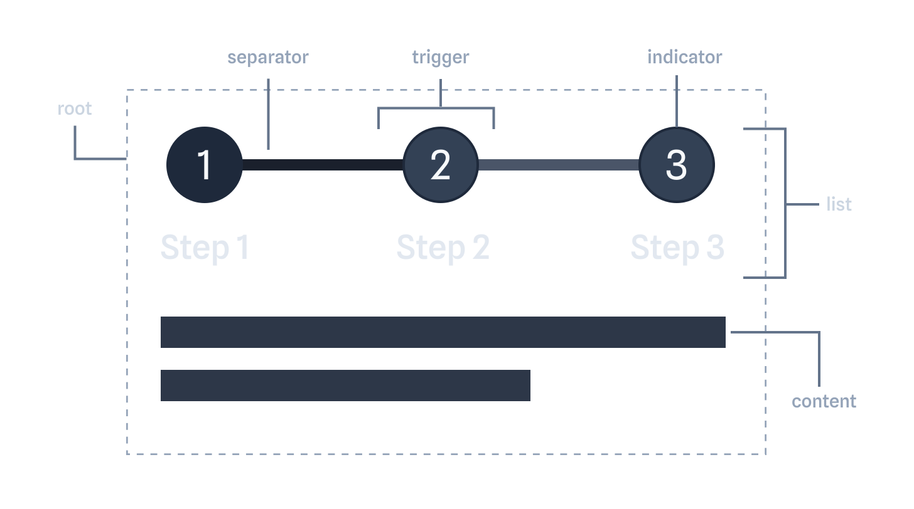

# Steps Challenge

Make the following code work. Do not use any UI libraries.

---

## Anatomy



---

## Types

These are the contracts your implementation must satisfy. **Do not change them.**

```ts
interface StepChangeDetails {
  /**
   * The step index that is now active
   */
  step: number;
}

interface StepInvalidDetails {
  /**
   * The step that failed validation
   */
  step: number;
  /**
   * What triggered the validation
   */
  action: "next" | "set";
  /**
   * The step the user tried to reach
   */
  targetStep?: number;
}

interface RootProps {
  /**
   * Total number of steps
   */
  count: number;
  /**
   * Called once when every step has been completed
   */
  onStepComplete?: () => void;
  /**
   * Return `false` to block forward navigation from a given step.
   *
   * @example
   * isStepValid={(index) => index !== 1 || formRef.current?.isValid}
   */
  isStepValid?: (index: number) => boolean;
  /**
   * Additional CSS class for the root element
   */
  className?: string;
  /**
   * The children of the steps component
   */
  children: React.ReactNode;

  // ── Bonus (controlled mode) ──────────────────────────
  /**
   * Initial active step (uncontrolled)
   */
  defaultStep?: number;
  /**
   * Active step index (controlled)
   */
  step?: number;
  /**
   * Called when the active step changes
   */
  onStepChange?: (details: StepChangeDetails) => void;
  /**
   * Called when navigation is blocked by `isStepValid`
   */
  onStepInvalid?: (details: StepInvalidDetails) => void;
}

interface ItemProps {
  /**
   * The index of the step
   */
  index: number;
  /**
   * Additional CSS class for the item element
   */
  className?: string;
  /**
   * The children of the item
   */
  children: React.ReactNode;
}

interface ContentProps {
  /**
   * The index of the step content
   */
  index: number;
  /**
   * Additional CSS class for the content element
   */
  className?: string;
  /**
   * The content to render when this step is active
   */
  children: React.ReactNode;
}

interface TriggerProps {
  /**
   * Additional CSS class for the trigger element
   */
  className?: string;
  /**
   * The children of the trigger
   */
  children: React.ReactNode;
}

interface IndicatorProps {
  /**
   * Additional CSS class for the indicator element
   */
  className?: string;
  /**
   * The content to render inside the indicator
   */
  children: React.ReactNode;
}

interface NavigationTriggerProps {
  /**
   * Additional CSS class for the navigation trigger
   */
  className?: string;
  /**
   * The label for the navigation button
   */
  children: React.ReactNode;
}
```

---

## Usage API

```tsx
const items = [
  { title: "First", description: "Contact info" },
  { title: "Second", description: "Date & time" },
  { title: "Third", description: "Select rooms" },
];

export default function App() {
  return (
    <Steps.Root count={items.length}>
      <Steps.List>
        {items.map((item, index) => (
          <Steps.Item key={index} index={index}>
            <Steps.Trigger>
              <Steps.Indicator>{index + 1}</Steps.Indicator>
              <span>{item.title}</span>
            </Steps.Trigger>
            <Steps.Separator />
          </Steps.Item>
        ))}
      </Steps.List>

      {items.map((item, index) => (
        <Steps.Content key={index} index={index}>
          {item.title} — {item.description}
        </Steps.Content>
      ))}

      <Steps.CompletedContent>
        All done — thanks for filling out the form!
      </Steps.CompletedContent>

      <div>
        <Steps.PrevTrigger>Back</Steps.PrevTrigger>
        <Steps.NextTrigger>Next</Steps.NextTrigger>
      </div>
    </Steps.Root>
  );
}
```

---

## Requirements

- All subcomponents accept a `className` prop
- `NextTrigger` and `PrevTrigger` must not go out of bounds
- `NextTrigger` must be disabled when `isStepValid` returns `false` for the current step
- `CompletedContent` only renders when all steps are done
- `onStepComplete` fires once when the last step is passed

## Bonus (optional — not required to pass)

- `Root` accepts `step` + `onStepChange` for controlled mode, `defaultStep` for uncontrolled
- Elements expose `data-complete`, `data-current`, or `data-incomplete` based on their state
- Add a `Steps.Consumer` that exposes the full internal context via render prop
